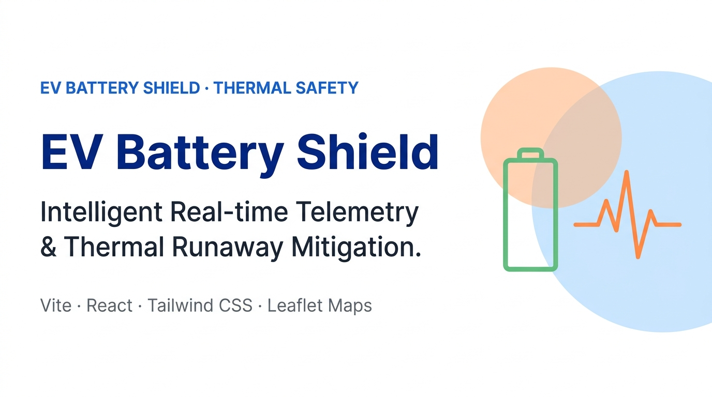
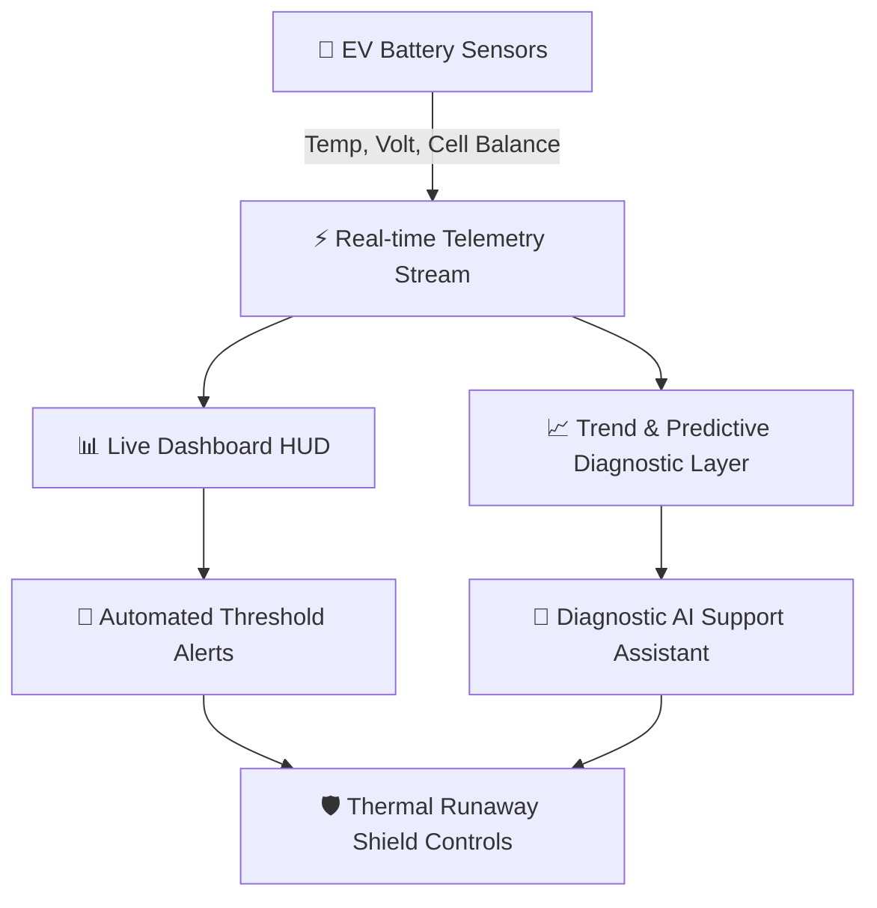

<p align="center">
  <a href="https://github.com/ByteBySway/ev-battery-shield">
    
  </a>
</p>

<p align="center">
  <strong>Intelligent Real-time Thermal Telemetry & Thermal Runaway Mitigation for Electric Vehicles.</strong>
</p>

<p align="center">
  <a href="https://ev-battery-shield.vercel.app">
    
  </a>
  
  
  
</p>

<p align="center">
  EV Battery Shield is a real-time thermal management and predictive diagnostic portal designed to prevent thermal runaway incidents in electric vehicle fleets. It fuses dynamic sensor streams (temperature, cell balance, current) with AI-powered diagnostic recommendations and interactive safety controls.
</p>

---

## 📌 Core Pipeline & Telemetry Architecture



* **Telemetry Engine**: Dynamic sensor simulation (volts, current, temperature alerts)
* **Design & Styling**: Tailwind CSS, Framer Motion, Radix UI primitives, Lucide Icons
* **Data Integration**: Base44 SDK integration for cloud entity storage and state tracking
* **Interactive Layer**: Recharts graphs, Three.js 3D renderings, and real-time battery status gauges

---

## 🚀 Key Functional Modules

| Portal Page | Purpose & Scope | Highlights |
| :--- | :--- | :--- |
| **📊 Dashboard** | Telemetry HUD & Status | Real-time gauge metrics, live temperature tracking, quick stats, active alarm pops |
| **🔄 Before/After** | Shield Safety Impact | Interactive visual comparison demonstrating the physical and thermal benefits of the shield |
| **📈 Graphs** | Historic Telemetry Charts | Recharts-based timelines for thermal status, voltage, current, and cell balance cycles |
| **💬 AI Diagnostics** | Chatbot Advisor | Interactive AI helper to interrogate battery anomalies and suggest immediate safety steps |
| **🏥 Safety Info** | Emergency Runaway Guides | Thermal runaway recovery checklist, fire prevention rules, and manual shutdown guides |
| **🔋 Fleet** | Fleet Vehicle List | Overview tracker showing status, mileage, and battery health score for the entire fleet |
| **🌱 Green Energy** | Environmental Impact | Track charging optimizer curves, CO2 emissions prevented, and battery life extensions |

---

## 🛠️ Local Installation & Setup

### Prerequisites
Ensure Node.js (version 20+) is installed on your system.

### 1. Project Setup
Clone the repository (once pushed) and install packages:
```bash
git clone https://github.com/ByteBySway/ev-battery-shield.git
cd ev-battery-shield
npm install
```

### 2. Run the Development Server
Start the local Vite dev server:
```bash
npm run dev
```
Open your browser and navigate to `http://localhost:5173`.

### 3. Build for Production
Create the optimized production build:
```bash
npm run build
.
.

```
.

---

## ⚖️ License & Disclaimers
This project is licensed under the MIT License - see the [LICENSE](LICENSE) file for details.

<!-- shark run 1 -->

<!-- pair contribution run -->
